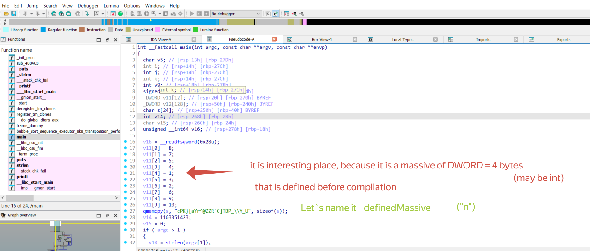
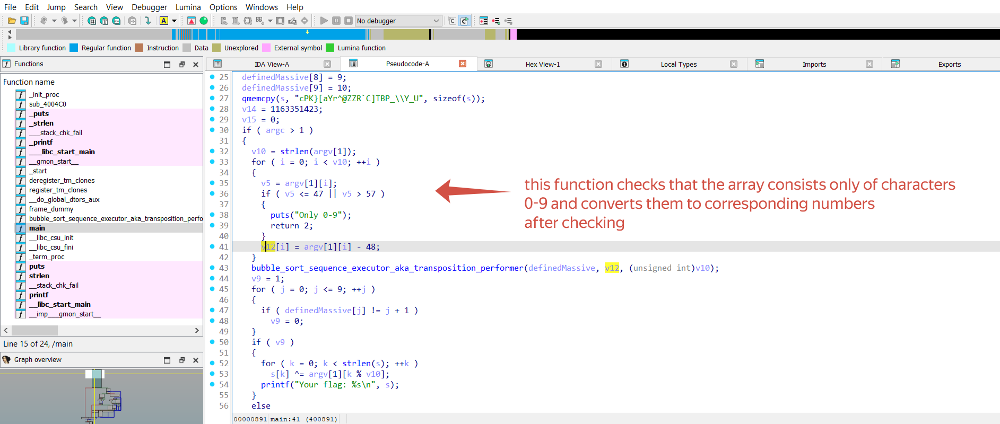

## Source:
https://rev-kids20.forkbomb.ru/tasks/RE2_timofey400
## Tools:
- IDA PRO with HexRays
## What is the task about?
The main part of this task is understending how work function that called "bubble_sort_sequence_executor_aka_transposition_performer" 
and for which purpose is it called.
 ## Writeup
 1.  At the begining, you need to install task executable file spbctf_4_x86_64(Linux version)
 2.  Then you need to drag this file in ida.exe. This action will move you to disassembler window,
 3.  After it you need to press the best F5 button in the world. This action will move you to HexRays decompiler
 4.  Firstly, I take my attention at massive of DWORD(4 bytes) elements, which are int I guess.
    This massive is defined before compilation and go to function "bubble_sort_sequence_executor_aka_transposition_performer" as an argument
    
 5. Moving further through the pseudocode, we see a block that checks an array of characters(argv - an argument of programm) to see if they represent numbers
    from 0 to 9.
    If the check is passed, the character (0-9) is converted to a number (0-9) and placed in the v12 array. Let`s name v12 as a "secretMassive"
    
