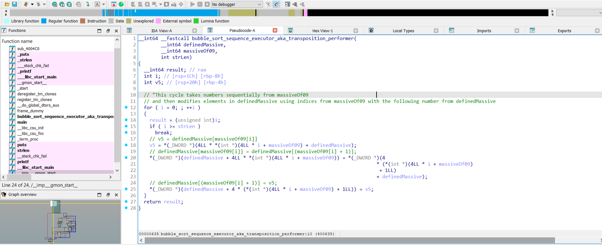
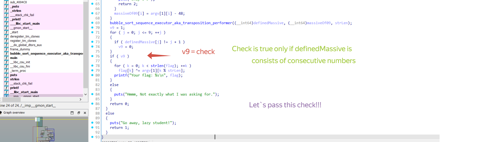
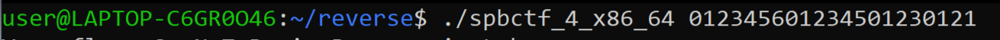

## Source:
https://rev-kids20.forkbomb.ru/tasks/RE2_timofey400
## Tools:
- IDA PRO with HexRays
## Writeup

## What is the task about?
The main part of this task is understanding how the function that is called "bubble_sort_sequence_executor_aka_transposition_performer" works
and for what purpose it is called.
## Steps
 1.  At the beginning, you need to install the task executable file spbctf_4_x86_64(Linux version)
 2.  Then you need to drag this file into ida.exe. This action will take you to the disassembler window,
 3.  After that you need to press the best F5 button in the world. This action will move you to the Hex-Rays decompiler
 4.  Firstly, I focused my attention on massive of DWORD(4 bytes) elements, which are int I guess.
    This massive is defined before compilation and go to function "bubble_sort_sequence_executor_aka_transposition_performer" as an argument
    
 5. Moving further through the pseudocode, we see a block that checks an array of characters(argv - a program argument) to see if they represent digits
    from 0 to 9.
    If the check is passed, the character (0-9) is converted to a number (0-9) and placed in the v12 array. Let`s name v12 as a "massiveOf09"
    

6. Take a look at the next screenshot, which shows how "bubble_sort_sequence_executor_aka_transposition_performer" works.
   In the comments, I've explained what each line does in a more human-friendly way.
    
7. We've almost solved the problem. Let`s take a look at the check that determines whether we can get the flag or not. To pass this check we must create
   a transposition combination which is a argv string
   
8. 

